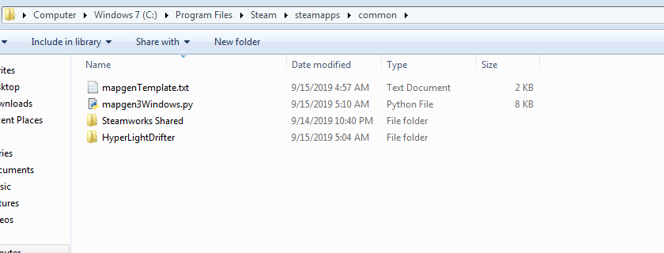

# Windows Installation
* Install Python 3.x.x from http://www.python.org/download/windows/
  * 3.7.4 Download Windows x86-64 executable installer
* Download Zip this project (green button topish right) [Clone or download] https://github.com/ychnh/HLDMapGeneration
* Find your HyperLightDrifter install path.
  * In steam this can be found by right clicking game in library->properties->local files->browse local files
  * Copy the files in "Windows Files to replace" into the appropriate directory into your game.
  * Copy mapgen3Windows.py and mapgenTemplate.txt in the directory right outside the HyperLightDrifter path
  
* Click the mapgen3Windows.py and a command prompt should come up and show it generated a map and continue running.
* Launch Hyper Light Drifter, Start a new game, Walk down and take the elevator and enjoy the mod.
* You can type '/skip' in the intro video to skip the long intro video

Please keep in mind it is in rough stages.
