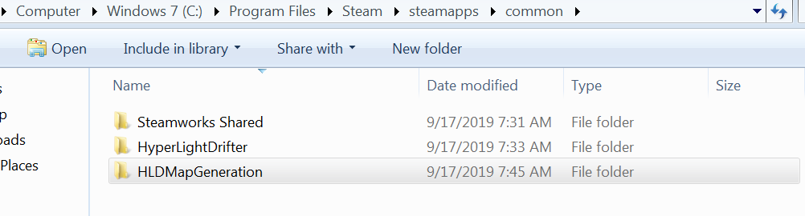
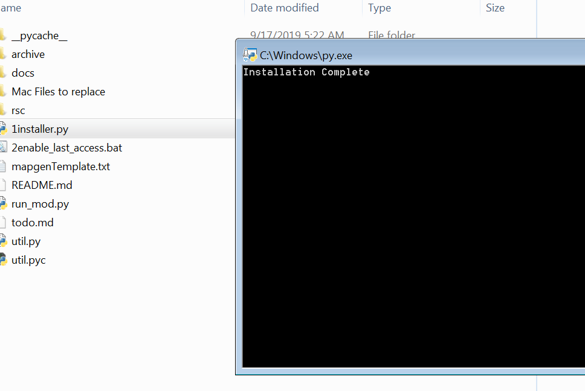
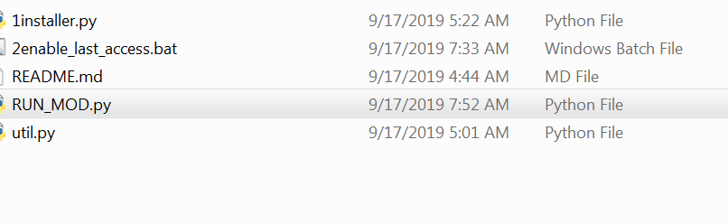

# Windows Installation
* Install Python 3.x.x from http://www.python.org/download/windows/
  * 3.7.4 Download Windows x86-64 executable installer
* Download Zip this project (green button topish right) [Download Zip] https://github.com/ychnh/HLDMapGeneration
* Unzip and move contents into the folder **Like in picture below**

* Run 1install.py

* Run 2enable_last_access.bat **AS ADMIN. THIS IS A MUST*

* **RESTART YOUR COMPUTER**
* Run run_mod.py

# Additional Notes and How to Play the GAME
* Create a new savefile and enjoy. You can skip the intro cutscene video with /skip
* Walk down the road in spawn and take the televator it will take you to **HUB**
* Go **LEFT** to go into the dungeon. This room will respawn each time you join it and get harder each time.
