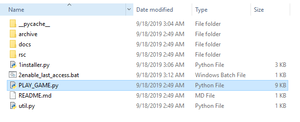

# Windows Installation
* Install Python 3.x.x from http://www.python.org/download/windows/
  * 3.7.4 Download Windows x86-64 executable installer
* Download this project https://github.com/ychnh/HLDMapGeneration/archive/master.zip
* Unzip and move contents into the folder outside HyperLightDrifter **Like in picture below**

* Go into the mod and Run 1install.py

* Run 2enable_last_access.bat **AS ADMIN. THIS IS A MUST** (This steps allows the mod to see when you accessed a level to regenerate it. You can open it in textpad to see that its contents and that it isn't malicious)

* **RESTART YOUR COMPUTER**
* Run run_mod.py

# Additional Notes and How to Play the GAME
* Create a new savefile and enjoy. You can skip the intro cutscene video with /skip
* Walk down the road in spawn and take the televator it will take you to **HUB**
* Go **LEFT** to go into the dungeon. This room will respawn each time you join it and get harder each time.
